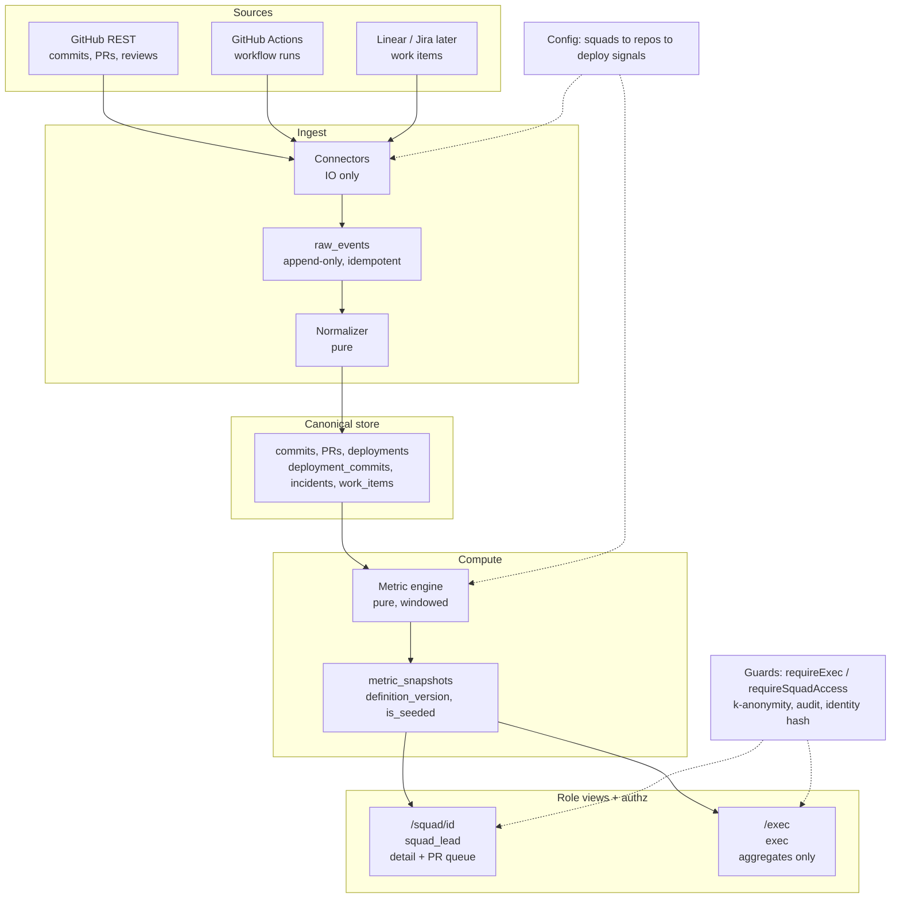
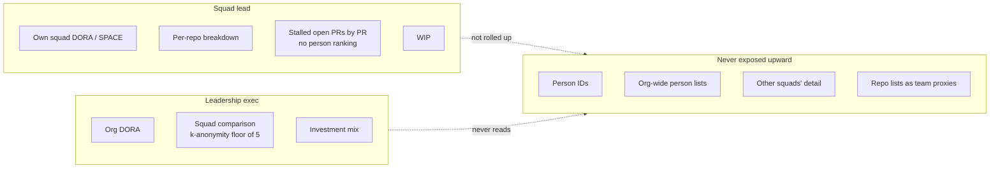
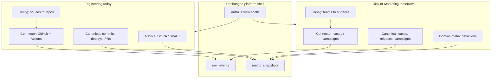

# MAL engineering productivity platform: written response

Context: about 8 squads and 30 engineers in fintech (borderless finance). This
matches the deployed system at https://dev-pulse-web.onrender.com.

## Section 1: Metric design

Leadership needs to know whether delivery is getting safer and faster. Squad
leads need to know where flow is stuck this week. Every metric below is computed
from a system of record.

### Full metric set

| Metric | Source | Computation | Anti-gaming |
| --- | --- | --- | --- |
| Deployment frequency | GitHub Actions (prod-signal workflows / Environments) | Successful prod deploys ÷ days; report deploys/day + DORA band | Count only named production success; skip/cancel out. Pipeline-splitting shows up against merge volume and batch size |
| Lead time for changes | Commits + Actions head SHAs | Per success: commits via compare(`prev`…`head`); LT = deploy finish − commit author; p50 / p95 | Commit to production (PR merge time is separate). Force-push caveat documented. Merging without shipping does not move this number |
| Change failure rate | Run status + reverts + linked incidents | Failures ÷ completed deploy attempts; failure = failed run, revert of shipped SHA, or incident | One signal is easy to game; three independent ones are harder. Green CI with a revert still counts |
| Failed-deploy recovery (MTTR) | Same signals + next success / resolve | Median failure → next successful prod deploy (or incident resolve) | Clock stops only on a real success or resolve in the system of record |
| Review responsiveness | PR + review comments | p50/p95 hours ready/open → first non-author review; bots out | Self-reviews and bots filtered. Empty "LGTM" with no comment is a known blind spot |
| Change batch size | Deploy commit sets + PR churn | Median commits per successful deploy; secondary median lines per merged PR | Explains lead-time moves. No-op pipeline spam → tiny batches and flat outcomes |
| Merge throughput | Merged PRs (bots out) | Merges / week | Always paired with batch size so more merges cannot look like progress alone |
| Unplanned work ratio | Linear/Jira (seeded until wired) | Completed bug+incident ÷ all completed (28d) | Relabeling bugs as tasks is process debt we surface, not something we "fix" in code |
| Flow efficiency | Same PM source | Median (active ÷ create→complete) on completed items | Lead diagnostic only; board-hygiene dependent, never the sole exec KPI |

### Deliberately excluded

- Individual ranking / "top contributors": Goodhart machine at 30 people; kills trust.
- Story points / velocity: manual, inconsistent, easy to inflate.
- Lines of code: often inverse to quality in fintech.
- PR-merge time labeled as "lead time": that is review latency; hides release risk.
- Composite "health score": opaque weights invite politics; show DORA bands with derivation.
- On-call pages as primary CFR: useful later; without deploy↔incident linking they
  double-count or miss silent failures. Incidents stay a third CFR signal.

## Section 2: Platform architecture

### Data flow

Sync is incremental (watermarks, ETags, request budget). A definition change
recomputes from `raw_events` without re-crawling GitHub. Org topology lives in
config, not code.

### Who sees what, and why

A lead can see individual items when they unblock flow (for example a PR waiting
days). Those details are not rolled up into org leaderboards. Exec never gets
squad drill-down or person-level lists.

### Access and security

The product touches every engineer's output, so the controls are load-bearing:

1. Auth: session JWT (`SESSION_SECRET`), httpOnly / Secure / SameSite.
2. Authz in the data layer: `requireExec` / `requireSquadAccess` on every page
   and API. Middleware only shapes UX redirects; APIs return 401/403.
3. Row-level squad scope: session `squadId` must match the requested squad. Exec
   cannot open `/squad/*`.
4. Payload design: exec assemblers never read contributor identifiers;
   aggregation happens before serialization.
5. k-anonymity: squads below the floor are suppressed in exec comparison.
6. Audit log: allow/deny on sensitive reads.
7. Identity hashing: contributor logins stored as salted hashes, not raw handles.

Demo credentials exist for grading. Production would use Mal SSO (OIDC) with the
same role claims; the guard surface stays the same.

### Extending beyond engineering without a rebuild

A new domain needs a connector, config, and metric definitions. The raw store,
snapshotter, authz, and view shells stay. For Risk that might mean policy-change
lead time and false-positive rate over case events. For Marketing: campaign ship
frequency and rollback rate over release events. Same pipeline shape.

## Section 3: 90-day execution plan

Solo builder at Mal. Prefer a usable leadership proof over feature breadth.
Public stand-in repos prove the plumbing; Mal private repos and Environments are
the production cutover.

### Days 1-30: Foundation and trust

Ship: deployed app, Postgres, bootstrap; demo roles (exec + two squad leads);
schema, raw store, synthetic seed with Seeded badges; GitHub + Actions
connectors, normalizer, four DORA metrics plus review/batch; `/exec` and
`/squad` with server-side RBAC and an access verification script; config-driven
squad/repo/deploy mapping.

Do not build: live Linear/Jira, SSO, mobile, Slack bots, custom domains,
multi-region, ML scoring.

Exit check: leadership can open `/exec` on a public URL; an eng lead sees only
their own squad; cross-role API calls return 403.

### Days 31-60: Mal ground truth

Ship: point config at Mal production repos; prefer GitHub Environments /
Deployments over workflow-name proxies; raise sync budget and scheduling;
durable watermarks; wire Linear or Jira for unplanned work and flow efficiency
(drop seed for those); exec investment mix from real issue types; freshness and
failure honesty in the UI; rotate secrets and prepare for SSO.

Do not build: per-person dashboards, an OKR product, warehouse export,
multi-tenant SaaS packaging.

Exit check: at least two Mal squads show live (non-proxy) deploy signals;
Seeded badges are gone from Mal DORA tiles.

### Days 61-90: Leadership habit and proof

Ship: reliable weekly auto-sync; a short "what changed" strip on `/exec` (band
moves and unplanned-work direction); deploy-signal confidence per repo in the UI;
one leadership review that uses only `/exec` (no spreadsheets); freeze scope and
fix only correctness and trust bugs.

Do not build: auto-remediation, eng performance reviews, cross-company
benchmarks, mobile apps, a rewrite onto a mesh of services.

### Day-90 proof number

Single number: org-level p50 lead time for changes (hours), rolling 28 days, on
Mal services that use a GitHub Environment (or equivalent) as the production
signal. Shown on `/exec` under Delivery performance → Lead Time for Changes.

How a non-technical leadership reviewer checks it:

1. Open the dashboard URL.
2. Sign in with the leadership account.
3. Read the Lead Time tile: value, DORA band, trend sparkline.
4. Confirm freshness shows a recent successful sync.
5. Confirm the tile is not labeled Seeded.

The system is working when that number comes from Mal production deploys, updates
via sync with no manual entry, and shows up in a leadership review against the
prior 28-day window. Direction matters more than hitting an arbitrary hour target
in the first quarter. Secondary glance: change failure rate band did not regress
while lead time moved.

## Section 4: What you'd change at 10× scale

Decision to reverse: a single Next.js process owns HTTP, sync/cron,
normalization, and metric materialization against Postgres.

At about 30 engineers that is the right call: one deployable, one failure domain,
and fast iteration. At 10× engineers (and 10× repos/events), sync and recompute
contend with request latency, single-instance cron becomes a bottleneck, and a
bad metric job can take down the leadership UI.

Replace it with the same logical pipeline, split at runtime:

- Web: Next.js, read-only against `metric_snapshots` (plus thin freshness).
- Worker: sync, normalize, and materialize (queue/cron), same database.
- Optional read replica for exec dashboards under concurrent load.

Connectors, raw store, definition versioning, and RBAC stay. Only the deployment
topology changes. That is why the append-only raw layer and pure metric functions
were worth keeping early: they survive the split.
